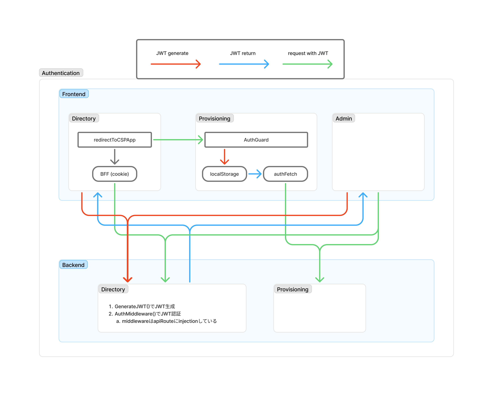

# CGAS 認証システム解説

CGASプロジェクトで使用されている認証システムの詳細解説です。マイクロサービス・マイクロフロントエンド間での認証情報の持ち回り方法とバックエンドでの認証処理について説明します。

## 認証システム概要

### 認証方式

- **JWT (JSON Web Token)** ベースの認証
- **HS256アルゴリズム** による署名
- **24時間の有効期限** （デフォルト）
- **Role-based Access Control (RBAC)** による認可

### 認証フロー概要

1. **ユーザーログイン** → Main API でJWT生成
2. **トークン保存** → フロントエンドで保存（Cookie/localStorage）
3. **API呼び出し** → Authorization Bearerヘッダーで送信
4. **トークン検証** → 各バックエンドサービスで検証
5. **認可チェック** → ユーザーロール・プロジェクト権限の確認

## アーキテクチャ図



## フロントエンド認証システム

### 1. Web App (メインアプリ) - Port 3000

**認証方式**: Cookie-based JWT Storage

#### 主要モジュール

- **`apps/web/lib/auth-middleware.ts`**: 認証ミドルウェア
- **`apps/web/contexts/AuthContext.tsx`**: 認証コンテキスト
- **`apps/web/pages/api/auth/token.ts`**: トークン取得API

#### 認証フロー

1. **ログイン**:

   ```typescript
   // POST /api/auth/login
   const response = await apiCall('/login', {
     method: 'POST',
     body: JSON.stringify({ email, password }),
   })

   // JWTをhttpOnlyクッキーに保存
   setAuthCookie(res, token)
   ```

2. **認証状態管理**:

   ```typescript
   // withAuth HOF でAPI Routesを保護
   export default withAuth(async (req, res, apiCall) => {
     // req.token, req.userId が利用可能
     const response = await apiCall('/protected-endpoint')
   })
   ```

3. **マイクロフロントエンド遷移**:

   ```typescript
   // JWT トークンをURL経由で安全に受け渡し
   const redirectToCSPApp = async (path: string) => {
     const tokenResponse = await authFetch('/api/auth/token')
     const { token } = await tokenResponse.json()

     const returnUrl = encodeURIComponent(window.location.href)
     const url = `http://localhost:3001${path}?token=${token}&returnUrl=${returnUrl}`
     window.open(url, '_blank')
   }
   ```

### 2. CSP Provisioning Web (マイクロフロントエンド) - Port 3001

**認証方式**: localStorage JWT Storage

#### 主要モジュール

- **`apps/csp-provisioning-web/src/contexts/AuthContext.tsx`**: 認証コンテキスト
- **`apps/csp-provisioning-web/src/components/AuthGuard.tsx`**: ルート保護

#### 認証フロー

1. **トークン受信**:

   ```typescript
   // URLパラメータからトークンとreturnUrlを取得
   useEffect(() => {
     const { token, returnUrl } = router.query
     if (token) {
       setToken(token) // localStorageに保存
       setReturnUrl(returnUrl)
     }
   }, [router.query])
   ```

2. **認証付きAPI呼び出し**:

   ```typescript
   const authFetch = useCallback(async (url: string, options = {}) => {
     const token = getToken()
     return fetch(url, {
       ...options,
       headers: {
         Authorization: `Bearer ${token}`,
         'Content-Type': 'application/json',
         ...options.headers,
       },
     })
   }, [])
   ```

3. **メインアプリへの復帰**:
   ```typescript
   const goBack = () => {
     if (returnUrl) {
       window.close() // 現在のタブを閉じる
       setTimeout(() => {
         window.location.href = returnUrl
       }, 100)
     }
   }
   ```

### 3. Web Admin (管理者アプリ) - Port 3010

**認証方式**: Cookie-based JWT Storage

#### 主要モジュール

- **`apps/web_admin/src/lib/auth.ts`**: 認証ライブラリ
- **`apps/web_admin/src/contexts/AuthContext.tsx`**: 認証コンテキスト

#### 認証フロー

```typescript
// 管理者専用の認証チェック
export async function authenticateRequest(
  request: NextRequest
): Promise<User | null> {
  const token = request.cookies.get('admin_auth_token')?.value
  if (!token) return null

  return await getProfileFromAPI(token)
}
```

## バックエンド認証システム

### 1. Main API (Port 8080) - JWT生成・検証

#### 主要モジュール

- **`apps/api/internal/middleware/auth.go`**: 認証ミドルウェア
- **`apps/api/internal/handler/auth.go`**: 認証ハンドラー

#### JWT生成

```go
// JWTClaims 構造体
type JWTClaims struct {
    UserID uint   `json:"user_id"`
    Email  string `json:"email"`
    Role   string `json:"role"`
    jwt.RegisteredClaims
}

// JWT生成関数
func GenerateJWT(user model.User) (string, error) {
    // システム管理者権限チェック
    isAdmin, err := CheckSystemAdminPermission(user.ID)

    role := "user"
    if isAdmin {
        role = "admin"
    }

    claims := JWTClaims{
        UserID: user.ID,
        Email:  user.Email,
        Role:   role,
        RegisteredClaims: jwt.RegisteredClaims{
            ExpiresAt: jwt.NewNumericDate(time.Now().Add(24 * time.Hour)),
            IssuedAt:  jwt.NewNumericDate(time.Now()),
        },
    }

    token := jwt.NewWithClaims(jwt.SigningMethodHS256, claims)
    return token.SignedString(jwtSecret)
}
```

#### 認証ミドルウェア

```go
func AuthMiddleware() gin.HandlerFunc {
    return func(c *gin.Context) {
        authHeader := c.GetHeader("Authorization")
        if authHeader == "" {
            c.JSON(http.StatusUnauthorized, gin.H{"error": "Authorization header is required"})
            c.Abort()
            return
        }

        tokenString := strings.TrimPrefix(authHeader, "Bearer ")
        claims, err := ValidateJWT(tokenString)
        if err != nil {
            c.JSON(http.StatusUnauthorized, gin.H{"error": "Invalid token"})
            c.Abort()
            return
        }

        // ユーザー情報をコンテキストに設定
        c.Set("user_id", claims.UserID)
        c.Set("user_email", claims.Email)
        c.Set("user_role", claims.Role)
        c.Next()
    }
}
```

#### 権限管理

```go
// システム管理者権限チェック
func RequireSystemAdmin() gin.HandlerFunc {
    return func(c *gin.Context) {
        userID, exists := c.Get("user_id")
        if !exists {
            c.JSON(http.StatusUnauthorized, gin.H{"error": "User not authenticated"})
            c.Abort()
            return
        }

        hasPermission, err := CheckSystemAdminPermission(userID.(uint))
        if !hasPermission {
            c.JSON(http.StatusForbidden, gin.H{"error": "System administrator privileges required"})
            c.Abort()
            return
        }

        c.Next()
    }
}
```

### 2. CSP Provisioning Service (Port 8081) - JWT検証

#### 主要モジュール

- **`apps/csp-provisioning-service/internal/middleware/auth.go`**: 認証ミドルウェア

#### JWT検証

```go
func AuthMiddleware() gin.HandlerFunc {
    return func(c *gin.Context) {
        authHeader := c.GetHeader("Authorization")
        tokenString := strings.TrimPrefix(authHeader, "Bearer ")

        // JWTトークンをパース
        token, err := jwt.ParseWithClaims(tokenString, &JWTClaims{}, func(token *jwt.Token) (interface{}, error) {
            // Main APIと同じ署名キーを使用
            jwtSecret := os.Getenv("JWT_SECRET")
            if jwtSecret == "" {
                jwtSecret = "your-secret-key-change-this-in-production"
            }
            return []byte(jwtSecret), nil
        })

        if claims, ok := token.Claims.(*JWTClaims); ok && token.Valid {
            // ユーザー情報をコンテキストに設定
            c.Set("user_id", claims.Email) // FirestoreではEmailを使用
            c.Set("user_email", claims.Email)
            c.Set("user_role", claims.Role)
            c.Next()
        } else {
            c.JSON(http.StatusUnauthorized, gin.H{"error": "Invalid token claims"})
            c.Abort()
        }
    }
}
```

## サービス間認証連携

### 1. フロントエンド間のトークン受け渡し

#### Web App → CSP Provisioning Web

```typescript
// 1. Web AppでJWTトークンを取得
const tokenResponse = await authFetch('/api/auth/token')
const { token } = await tokenResponse.json()

// 2. URLパラメータでトークンを渡す
const returnUrl = encodeURIComponent(window.location.href)
const url = `http://localhost:3001/path?token=${token}&returnUrl=${returnUrl}`

// 3. 新しいタブで開く
const newTab = window.open(url, '_blank')
setTimeout(() => window.close(), 1000) // 元タブを閉じる
```

#### CSP Provisioning Web側での受信

```typescript
// URLパラメータから取得
useEffect(() => {
  const { token, returnUrl } = router.query

  if (token && typeof token === 'string') {
    setToken(token) // localStorageに保存
    setReturnUrl(returnUrl)

    // URLをクリーンアップ
    router.replace(router.asPath.split('?')[0], undefined, { shallow: true })
  }
}, [router.query])
```

### 2. バックエンド間のAPI連携

#### CSP承認時の自動CSPアカウント作成

```go
// CSP Provisioning Service → Main API
func (s *CSPRequestService) createCSPAccount(ctx context.Context, cspRequest CSPRequest, reviewerID string) error {
    // Main APIの内部エンドポイントを呼び出し
    requestBody := AutoCreateRequest{
        CSPRequestID: cspRequest.ID,
        ProjectID:    cspRequest.ProjectID,
        Provider:     cspRequest.Provider,
        AccountName:  cspRequest.AccountName,
        RequestedBy:  cspRequest.RequestedBy,
    }

    // HTTPリクエストでMain APIを呼び出し
    response, err := http.Post(
        "http://api:8080/api/internal/csp-accounts/auto-create",
        "application/json",
        bytes.NewBuffer(jsonData),
    )

    if err != nil || response.StatusCode != 201 {
        return fmt.Errorf("failed to create CSP account")
    }

    return nil
}
```

## セキュリティ考慮事項

### 1. JWT署名キー管理

```bash
# 環境変数での設定
export JWT_SECRET="your-production-secret-key-here"
```

### 2. Cookie設定

```typescript
// httpOnly, secure, sameSiteの設定
const cookie = serialize('auth-token', token, {
  httpOnly: true, // XSS攻撃対策
  secure: process.env.NODE_ENV === 'production', // HTTPS必須
  sameSite: 'strict', // CSRF攻撃対策
  maxAge: 60 * 60 * 24 * 7, // 7日間
  path: '/',
})
```

### 3. CORS設定

```go
// Ginでの設定
config := cors.DefaultConfig()
config.AllowOrigins = []string{
    "http://localhost:3000",  // Web App
    "http://localhost:3001",  // CSP Provisioning Web
    "http://localhost:3010",  // Web Admin
}
config.AllowCredentials = true
```

### 4. トークン有効期限管理

- **短期間の有効期限**: 24時間（セキュリティ向上）
- **リフレッシュトークン**: 現在未実装（将来的な拡張予定）

## トラブルシューティング

### よくある認証エラー

#### 1. "Invalid token" エラー

```bash
# JWT署名キーの不一致をチェック
echo $JWT_SECRET

# 各サービスで同じキーが使用されているか確認
docker-compose exec api printenv JWT_SECRET
docker-compose exec csp-provisioning printenv JWT_SECRET
```

#### 2. CORS エラー

```javascript
// ブラウザコンソールでOriginをチェック
console.log(window.location.origin)

// 許可されたOriginリストと比較
```

#### 3. Cookie が保存されない

```javascript
// ブラウザ開発者ツールでCookie確認
document.cookie

// httpOnly Cookieはスクリプトから見えないことに注意
```

### デバッグ方法

#### フロントエンド

```typescript
// AuthContextでのデバッグログ
console.log('fetchUser: トークンチェック:', token ? 'あり' : 'なし')
console.log('fetchUser: ユーザー情報取得成功:', userData.email)
```

#### バックエンド

```go
// Ginでのリクエストログ
log.Printf("AuthMiddleware: %s %s from %s", c.Request.Method, c.Request.URL.Path, c.ClientIP())
log.Printf("AuthMiddleware: Authorization header: %s", authHeader)
```

## 今後の拡張予定

### 1. リフレッシュトークン

- 長期間のセッション維持
- セキュリティ向上

### 2. OAuth2.0 / OpenID Connect

- 外部プロバイダー連携
- SSO (Single Sign-On)

### 3. Multi-Factor Authentication (MFA)

- TOTP (Time-based One-Time Password)
- SMS認証

### 4. セッション管理

- Redis でのセッション管理
- 複数デバイス対応

---

この認証システムにより、マイクロサービス・マイクロフロントエンド間でセキュアな認証・認可が実現されています。
